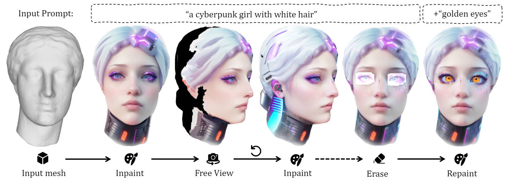

# InteX

This repository contains the official implementation for *InteX: Interactive Text-to-Texture Synthesis via Unified Depth-aware Inpainting*.

### [Project Page](https://me.kiui.moe/intex/) | [Arxiv](https://arxiv.org/abs/TODO)



### Install
```bash
pip install -r requirements.txt

# nvdiffrast
pip install git+https://github.com/NVlabs/nvdiffrast/
```

### Usage
```bash
### generate texture for a mesh based on a prompt (command line), output will be saved to ./logs
# please check ./configs/revani.yaml for each parameter's meaning
python main.py --config configs/revani.yaml mesh=data/dragon.glb prompt="a red pet dragon with fire patterns" save_path=dragon_fire.glb text_dir=True

### open local GUI for interactive editing
python main.py --config configs/revani.yaml mesh=data/dragon.glb prompt="a red pet dragon with fire patterns" save_path=dragon_fire.glb text_dir=True gui=True

### simple web GUI with gradio
python app.py
```

Please check `./scripts` for more examples.

### Acknowledgement

This work is built on many amazing research works and open-source projects, thanks a lot to all the authors for sharing!

- [nvdiffrast](https://github.com/NVlabs/nvdiffrast)
- [dearpygui](https://github.com/hoffstadt/DearPyGui)

### Citation

```
@article{tang2024intex,
  title={InTeX: Interactive Text-to-Texture Synthesis via Unified Depth-aware Inpainting},
  author={Tang, Jiaxiang and Lu, Ruijie and Chen, Xiaokang and Wen, Xiang and Zeng, Gang and Liu, Ziwei},
  journal={arXiv preprint arXiv:TODO},
  year={2024}
}
```
